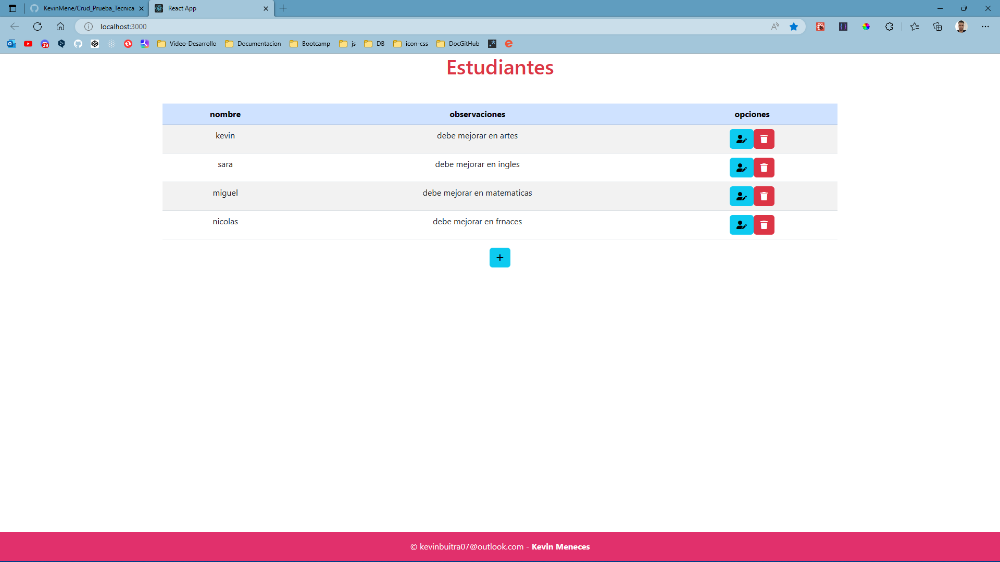
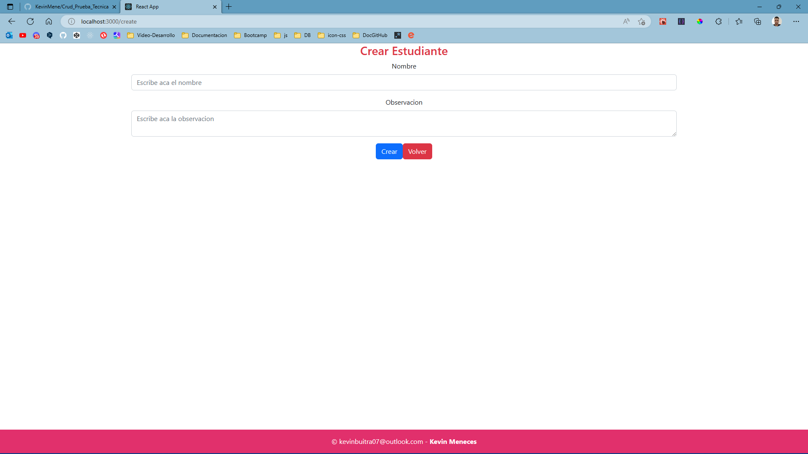
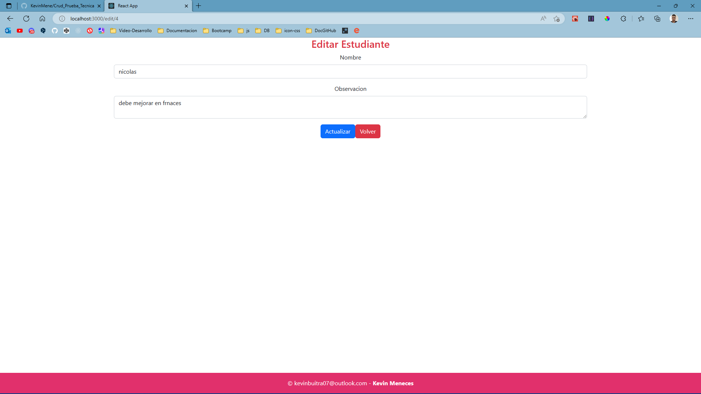
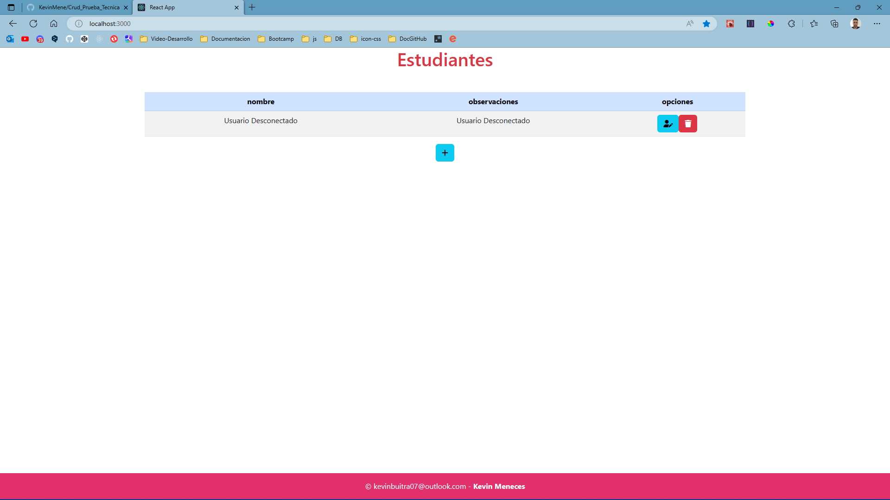

# Prueba Tecnica Crud-Estudiantes

Esta Prueba tecnica fue realizada con las siguientes herramientas

### +Html
### +JavaScript
### +Reac JS
### +Node Js
### +MySQL

#
## Correr el proyecto

El proyecto se puede correr de la sigueinte manera:

### `Carpeta Frontend`
### `npm start`

Corre toda la parte del frontent

### `Carpeta Backend`
### `npm run dev`
corre toda la parte del backend
#

# Visualizacion Del Proyecto Conectado a la DataBase

  <h3>Aca podemos Visualizar la parte principal del CRUD</h3>
  

  
  

  <h3>Aca podemos Visualizar la parte de Crear del CRUD</h3>
  

  </img>
  

  <h3>Aca podemos Visualizar la parte de Actualizar del CRUD</h3>
  

  </img>
  

#
# Visualizacion Del Proyecto Desconectado a la DataBase

  

  </img>
  

#
